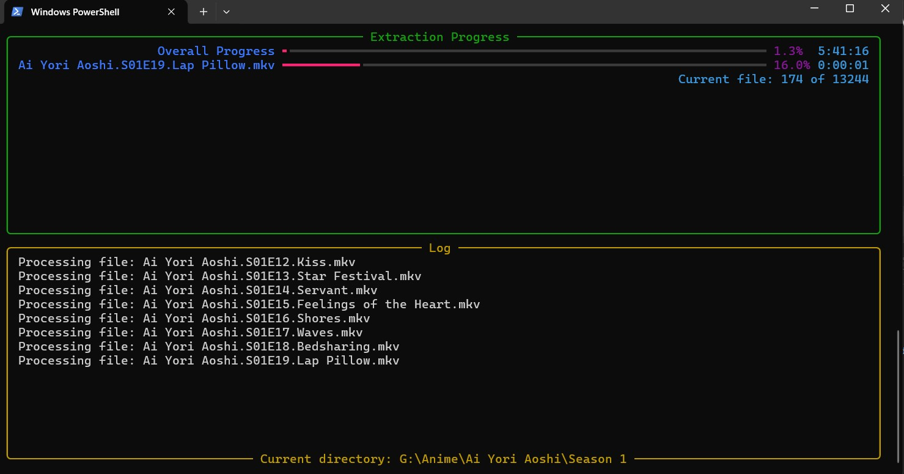

# <span style="color: #4a86e8;">🎬 MKV Extractor</span>

<div align="center">
  
  
  
</div>


> <span style="color: #34a853;">Preserve your favorite fansubs with ease!</span>

## <span style="color: #ea4335;">🚀 Introduction</span>

MKV Extractor is a powerful tool designed primarily for archiving fansubs. It extracts chapters, subtitles, and fonts from MKV files, preserving the hard work of fansubbers and ensuring that high-quality subtitles and typesetting are not lost to time.

## <span style="color: #fbbc05;">✨ Features</span>

- 📂 Bulk extraction from multiple MKV files
- 📑 Extracts chapters, subtitles, and fonts
- 🎨 Preserves subtitle styles and fonts
- 📊 Real-time progress tracking with rich console interface
- ⚙️ Configurable settings with automatic config file management
- 📝 Detailed logging
- 🖥️ Cross-platform support (Windows, Mac, Linux)
- 🔍 Automatic MKVToolNix detection on Windows
- 🚀 Optional parallel processing for faster extraction

## <span style="color: #4a86e8;">🛠️ Installation</span>

1. Ensure you have Python 3.9 or higher installed.
2. Clone this repository:
   ```
   git clone https://github.com/yourusername/mkv-extractor.git
   cd mkv-extractor
   ```
3. Install the required Python module:
   ```
   pip install rich
   ```
4. Install MKVToolNix:
   - **Windows**: Download and install from [here](https://mkvtoolnix.download/). The script will attempt to find it automatically.
   - **Mac**: Use Homebrew: `brew install mkvtoolnix`
   - **Linux**: Use your distribution's package manager, e.g., for Ubuntu:
     ```
     sudo apt update
     sudo apt install mkvtoolnix
     ```

## <span style="color: #34a853;">⚙️ Configuration</span>

The script automatically creates and manages a configuration file `mkv_extractor_config.ini` in the same directory as the script. Here's a sample configuration:

```ini
[Paths]
input_dir = /path/to/your/anime
output_dir = /path/to/your/output
mkvextract_path = /path/to/mkvextract

[Settings]
use_parallel = false
max_workers = 4
max_log_lines = 1000
```

- `input_dir`: Directory containing your MKV files
- `output_dir`: Directory where extracted files will be saved
- `mkvextract_path`: Path to the mkvextract executable
- `use_parallel`: Set to `true` for parallel processing (faster but may use more resources)
- `max_workers`: Maximum number of parallel workers (if `use_parallel` is `true`)
- `max_log_lines`: Maximum number of log lines to keep in memory

Note: On Windows, the script will attempt to find MKVToolNix automatically and update the config file.

## <span style="color: #ea4335;">🚀 Usage</span>

Run the script with:

```
python mkv_extractor.py
```

Or specify custom paths:

```
python mkv_extractor.py --input_dir "/path/to/input" --output_dir "/path/to/output" --mkvextract_path "/path/to/mkvextract"
```

## <span style="color: #fbbc05;">📊 Progress Tracking</span>

The script provides real-time progress tracking with a beautiful interface:

<p align="center">
  
</p>

## <span style="color: #4a86e8;">📁 Output Structure</span>

```
output_dir/
├── anime_name/
│   ├── chapters/
│   │   └── episode01_chapters.xml
│   ├── subs/
│   │   └── episode01_track2[English].ass
│   └── fonts/
│       └── custom_font.ttf
└── info.txt
```
The script preserves the original directory structure and copies any `info.txt` files found in the source directories.

## <span style="color: #ea4335;">📄 License</span>

This project is licensed under the MIT License - see the [LICENSE](LICENSE) file for details.

## <span style="color: #fbbc05;">🔧 Troubleshooting</span>

- If you encounter a "command not found" error for mkvextract, ensure it's installed and in your system's PATH.
- On Mac/Linux, you might need to make the script executable: `chmod +x mkv_extractor.py`
- If you're having issues with file permissions on Mac/Linux, try running the script with sudo (not recommended for regular use).
- For Windows users, if the script can't find MKVToolNix automatically, you'll be prompted to enter the path manually.

---

